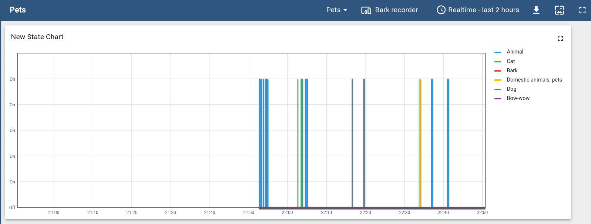

# Bark monitor

[](https://snapcraft.io/bark-monitor)


Showing my neighbor my dog doesn't bark!

## Introduction

Do you also have neighbor who accuses your dog of barking all the time, want to kick you out of your flat because of it, even though you know _it's not true_?
Do you want to know if your dog is actually noisy when you are gone but you don't (and don't want to buy) a baby cam?

Then this project is for you!

## How to use the bark monitor

The bark monitor will:

* Record your dog while you are gone.
  The recordings are saved in a folder to enable you to really show that neighbor they are full of shit.
* Monitor its barking real time and send you notification through a Telegram bot when your neighbor drives the dog crazy and they barks.
  Detection of the bark can be done using the [Yamnet](https://www.tensorflow.org/hub/tutorials/yamnet) neural network implemented in tensorflow, or the amplitude of the signal.
  Using Yamnet, cats are also tracked ;).

## Install and use

Install with tensorflow for Deep Learning based detection using [Yamnet](https://www.tensorflow.org/hub/tutorials/yamnet):

`pip install .[ml]`

Install without tensorflow to use amplitude based detection:

`pip install .`

Tested with python 3.9, should work with higher versions too.

> If the compilation fails due to c compiler errors, you might need to install gcc/g++.
> On Ubuntu: `sudo apt install build-essential`

To run the unit tests and be able to contribute, install the package in editable mode using the `-e` option for pip.

Once the library is installed , create a [Telegram bot](https://www.rowy.io/blog/create-telegram-bot) and obtain the api key.
Then, ceate a config file somewhere with this content (change to the correct values for your hardware):

```json
{
  "api_key": "you api key",
  "output_folder": "where to save the recordings",
  "config_folder": "where to save the telegram bot configuration",
  "sampling time bark seconds": 1,
  "microphone framerate": 16000
}

```

Start the program by running `python3 bark_monitor/cli/yamnet_record.py --config-file <path to config file>` to launch the NN based detection.
If you are on Raspberry Pi or other device, consider using the [TFlite version of Yamnet](https://tfhub.dev/google/lite-model/yamnet/classification/tflite/1) by using `python3 bark_monitor/cli/yamnet_lite_record.py --config-file <path to config file>` instead.

If you are launching the program for the first time and went to register new users to the bot add the flag `--accept-new-users` and send `\register` to the telegram bot

## Recordings

Recordings are saved in `output_folder` in different folder for each day and time stamped:

```bash
output_folder
  |--18-05-2026
      |--18-05-2023-14-12.wav
      |--18-05-2023-15-10.wav
      |--recording.json

```

`recording.json` contains info about the day: when was the recorder on, how long has the dog barked.

## Telegram bot

To see all commands available to the bot, send `\help` to your bot.

Example of commands available to the bot are:

* `\register`: register to receive updates from the bot.
* `\start`: start the recorder
* `\stop`: stop the recorder
* `\status`: get the current status of the recorder -> is it recording and how long as the animal barked today.
* `\pause`: pause the current recording without stopping it---on/off time won't be registered in the app state.
* `\unpause`: restart a paused recorder.
* `\bark_level`: return the threshold for amplitude if using the amplitude based detection.

See in the file `bark_monitor/very_bark_bot.py` to see the commands available to the bot.

## Thingsboard

It is possible to log the barks onto [Thingsboard](https://thingsboard.io/).
First, [create a device](https://thingsboard.io/docs/getting-started-guides/helloworld/#step-1-provision-device) on ThingsBoard, and then simply add:

```json
  "thingsboard_device_token": "Device token",
  "thingsboard_ip": "ip address",
  "thingsboard_port": port number,
```

with the correct value to the `config.json` file created previously.

You can visualize in realtime your pets behavior on a dashboard:



## Contributions

Contributions are always welcome to help show my neighbor is wrong!

Code submitted should be formatted with [black](https://pypi.org/project/black/) and pass `flake8 .` with no errors.
All methods should be type hinted and return types should always be present even when it's `None`.

If possible, submit unit tests and a picture of your dog with your PR (I also accept cat pictures as payments).
