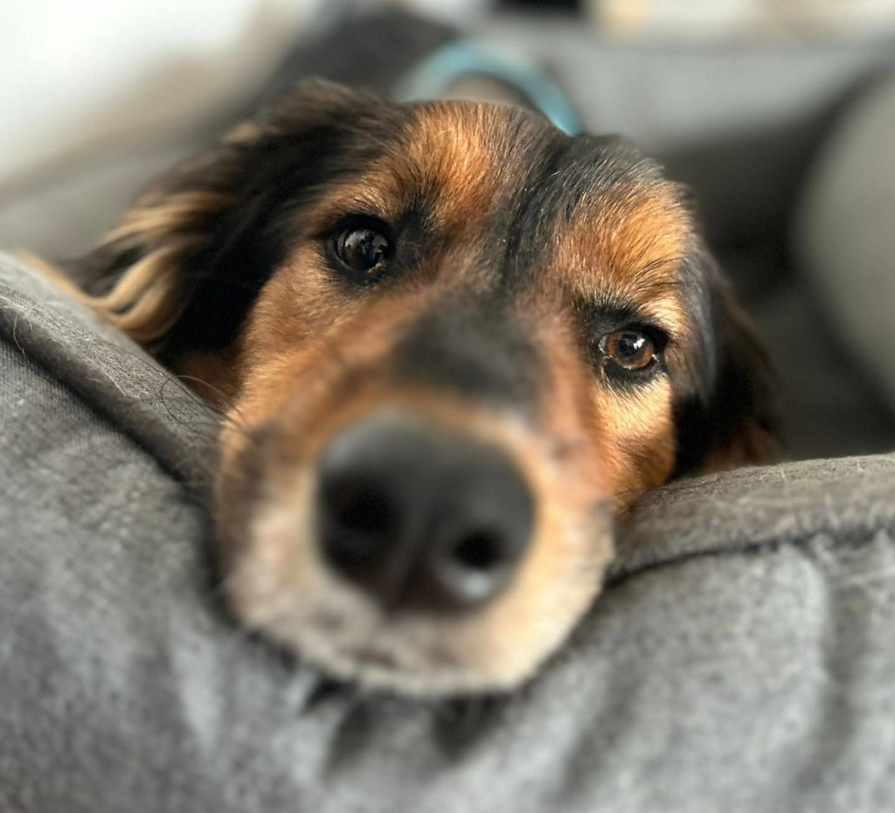

# Bark monitor

[](https://snapcraft.io/bark-monitor)



Showing my neighbor my dog doesn't bark!

## Introduction

Do you also have neighbor who accuses your dog of barking all the time, want to kick you out of your flat because of it, even though you know _it's not true_?
Do you want to know if your dog is actually noisy when you are gone but you don't (and don't want to buy) a baby cam?

Then this project is for you!

## Install

`pip install -e .`

Tested with python 3.9, should work with higher versions too.

## How to use the bark monitor

The bark monitor will:

* Record your dog while you are gone.
  The recordings are saved in the `recordings` to really show that neighbor they are full of shit.
* Monitor its barking real time and send you notification through a Telegram bot when your neighbor drives the dog crazy and they barks.

To setup the program:

1. Create a [Telegram bot](https://www.rowy.io/blog/create-telegram-bot) and obtain the api key.
2. Create a config file somewhere with this content:

   ```
    {
      "api_key": "you api key",
      "output_folder": "where to save the recordings",
      "config_folder": "where to save the telegram bot configuration"
    }

    ```

3. Start the program by running `python3 scripts/yamnet_record.py --config-file <path to config file>` to launch the NN based detection.
   If you are launching the program for the first time and went to register new users to the bot add the flag `--accept-new-users` and send `\register` to the telegram bot

See in the file `bark_monitor/very_bark_bot.py` to see the commands available to the bot.

## Contributions

Contributions are always welcome to help show my neighbor is wrong!

Code submitted should be formatted with [black](https://pypi.org/project/black/) and pass `flake8 .` with no errors.
All methods should be type hinted and return types should always be present even when it's `None`.

If possible, submit unit tests and a picture of your dog with your PR (I also accept cat pictures as payments).
