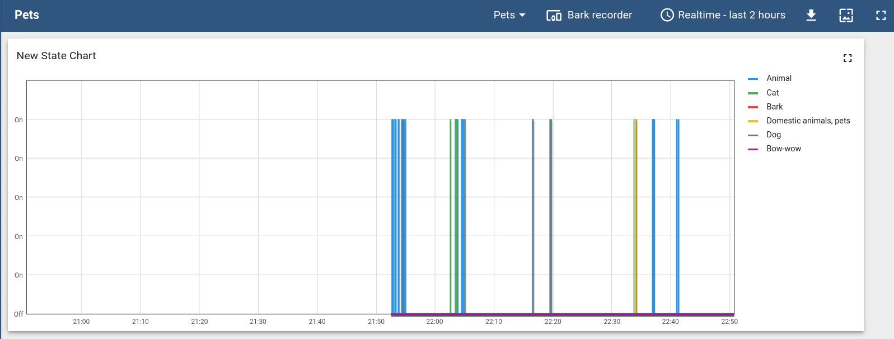

# Thingsboard

It is possible to log the barks onto [Thingsboard](https://thingsboard.io/).
First, [create a device](https://thingsboard.io/docs/getting-started-guides/helloworld/#step-1-provision-device) on ThingsBoard, and then simply add:

```json
  "thingsboard_device_token": "Device token",
  "thingsboard_ip": "ip address",
  "thingsboard_port": port number,
```

with the correct value to the [config file](record.md#set-up-the-configuration-file).

You can visualize in realtime your pets behavior on a dashboard:


